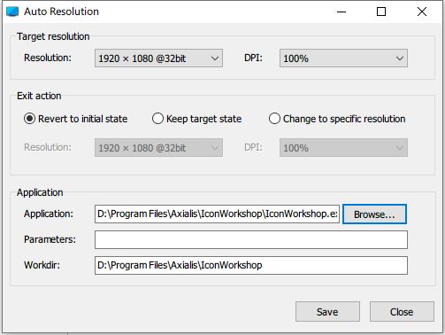

# AutoRes

## What is AutoRes?
* Automatically set screen resolution and DPI.
* Launch the application specified
* Restore the original screen resolution and DPI when the application is closed.

## Limitations
* Only works on your primary monitor.
* Child processes created by the primary process are not traced
* Administrator privileges are required, but the application to be launched won't be granted admin privileges.

## ScreenShot

## How to use
1. Run `AutoRes.exe`
2. Select the target resolution and DPI.
3. Select how you want the resolution and DPI to be set after application exits
4. Click the "Browse..." button and select the application you want to run.
5. Create your new shortcut by clicking "Save" button.